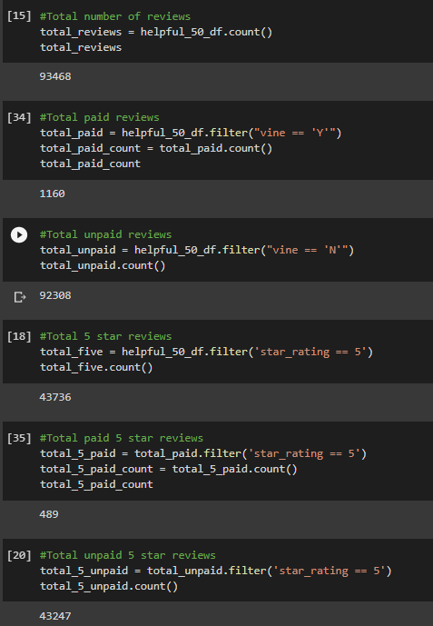
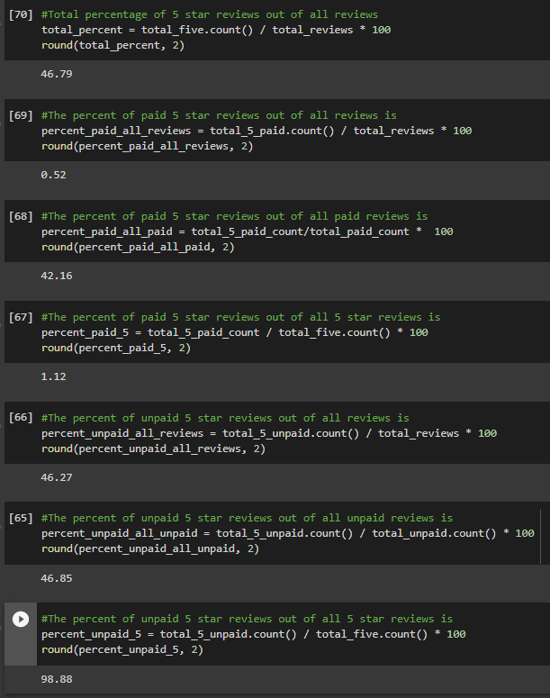

# Amazon Vine Analysis 

## Overview of the analysis
In this project, we will be examining the paid reviews done by members of the Amazon Vine Program. "The Amazon Vine program is a service that allows manufacturers and publishers to receive reviews for their products." The data used is from Amazon's Review Datasets, and the selected dataset is on kitchen reviews.

Resources:
- PySpark, Google Colab
- Amazon AWS 
- PgAdmin, postgresSQL
- Amazon Review Datasets, 'kitchen' dataset 

In the first part of this analysis(Amazon_Reviews_ETL.ipynb), we will split the data into four tables: customers, products, reviews, and vine. Condensing the data into these groups will make it easier to understand and analyze. The tables will have the following data:
- Customers
  - customer id and customer count
- Products 
  - product id and product title
- Reviews (review_id)
  - review id, customer id, product id, product parent, and review date
- Vine (vine program reviews)
  - review id, star rating, helpful votes, total votes, vine, verified purchase 

After creating these tables using PySpark, we then connect our Amazon RDS and use it to import the table data into pgAdmin. 

## Results of Vine Analysis 
The second part of this analysis(Vine_Review_Analysis.ipynb), we will gather further information on the vine table. 

- The kitchen reviews dataset has 93,468 reviews in total. 
  - The total number of paid Vine reviews is 1,160. 
  - The total number of unpaid reviews is 92,308.

- The total number of 5 star reviews is 43,736.
  - The total percentage of paid Vine  5 star reviews out of all reviews is 0.52%.
  - The total percentage of unpaid 5 star reviews out of all reviews is 46.27%.
 
- Out of all the reviews, 46.79% of them were 5 star reviews. 
  - Out of all the paid Vine reviews, 42.16% of them were 5 star reviews. 
  - Out of all the unpaid reviews, 46.85% of them were 5 star reviews. 
  - Out of all 5 star reviews, 1.12% of them were paid(Vine).
  - Out of all 5 star reviews, 98.88% of them were unpaid.

Here are the images of that data: 

## Summary 
There isn't positivity bias for reviews within the Vine program when it comes to kitchen reviews. This can be seen in the amount of five star reviews. 

Nearly half of all paid reviews (42.16%) were five star reviews. There were only 1160 paid reviews out of 93,468. While it may seem like there is some bias there, this amount is similar to all unpaid reviews that were five star reviews (46.85%). Finally comparing the amount of five star reviews out of all reviews is also 46.79%. The paid reviews could be seen as the sample and the unpaid reviews the population.

There isn't a huge difference in this number, but to validate whether or not it's a statistical difference we would need further analysis. This was just one dataset out of many. Does product category have an effect on Vine reviews? Are Vine members likely to think critically about how to review a product based on the category? 

We would have to conduct this analysis with every dataset and then compare the differences in paid v unpaid 5 star reviews. From there we could determine if there is positivity bias in the Vine program.
